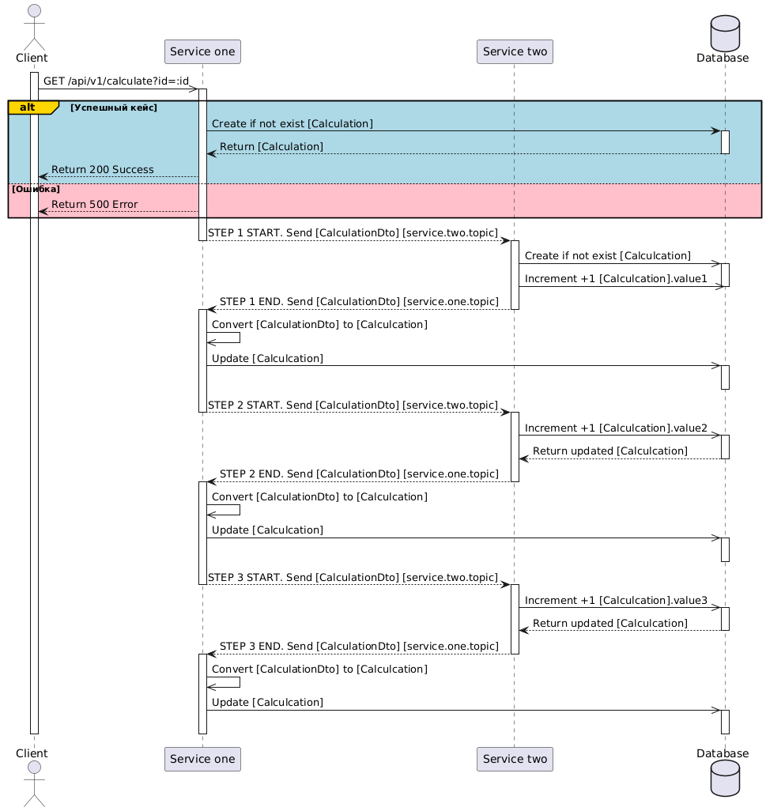

# Highload Performance Test Project

## Description
This project is designed to demonstrate a simple example of a highload performance test within a microservice architecture.
All microservices based on spring boot 3 with event driven interaction based on kafka

## Purpose:
This project explores the concept of handling high-volume data and processing within a microservice architecture. It consists of three interconnected services, each responsible for a specific step in a data processing pipeline.

## Component
1. service-one: This service represents the first stage of the performance testing pipeline.
2. service-two: This service receives data from "service-one" and processes it further.
3. service-three: This service represents the third stage of the performance testing process.
1. Grafana
2. Kafka
3. provectuslabs/kafka-ui
4. Postgresql
5. Guntling
6. Jaeger

## Algorithm:


This project simulates a three-step process where each service performs a specific task:

- Service-One:
    - Receives a request from a client (e.g., a load testing tool) to perform a calculation.
    - Performs a specific task (e.g., "STEP_ONE" - accessing and retrieving data from a database).
- Service-Two:
    - Receives data from "service-one" (which is assumed to be generated by a separate service).
    - Performs a specific task (e.g., "STEP_TWO" - further processing data).
    - Performs a specific task (e.g., "STEP_TWO" processing) on the data.
    - Sends the processed data (e.g., "STEP_TWO" data) to a Kafka topic.
- Service-Three:
    - Receives the data from "service-two" (which is assumed to be pre-processed by "service-one").
    - Processes the data received from "service-two" (e.g., "STEP_TWO" processing).
    - Sends the final processed data to a Kafka topic (e.g., "STEP_THREE" data).

## How to Run:
This project requires Docker and Docker Compose to be installed.
Clone the repository:
```
git clone <repository_url>
```

Build the services:
```
docker-compose build
```

Run the services:
```
docker-compose up -d
```
Note: This README assumes you are familiar with basic concepts of Kafka and microservices.


# Prometheus and grafana
In this project added prometheus metrics with grafana

https://coderstower.com/2021/11/16/spring-boot-observability-setting-up-micrometer-grafana-and-prometheus/
https://spring.academy/guides/spring-spring-prometheus

Added:
1. Dependency **spring-boot-starter-actuator**. For prometheus
2. Dependency **micrometer-registry-prometheus**. For custom prometheus metric
3. Configuration for actuator:
```yaml
management:
  endpoints:
    enabled-by-default: true
    web:
      exposure:
        include: '*'
  endpoint:
    health:
      show-details: always
```
4. Scrape config for prometheus ./docker/config/prometheus/prometheus.yml
5. @Timed annotation for handlers and controller
5. For each service, prometheus metrics can be accessed by this url
   `http://localhost:<service.port>/actuator/prometheus`
6. Check prometheus http://localhost:9090
7. Check grafana http://localhost:3000 Username: admin; Password: admin;
8. Add Prometheus as a data source by navigating to Configuration > Data Sources > Add data source in Grafana’s UI. We select Prometheus as the type and specify the URL where Prometheus is running, usually http://localhost:9090 (or `http://<container_name>:9090`).
   Save & Test to confirm Grafana can successfully connect to Prometheus.

# Tracing and logging

## Kafka Tracing with Spring Boot and Open Telemetry
We will use the Micrometer library for sending traces and Jaeger for storing and visualizing them. Spring Kafka comes with built-in integration with Micrometer for the KafkaTemplate and listener containers. You will also see how to configure the Spring Kafka observability to add our custom tags to traces.

https://piotrminkowski.com/2023/11/15/kafka-tracing-with-spring-boot-and-open-telemetry/

