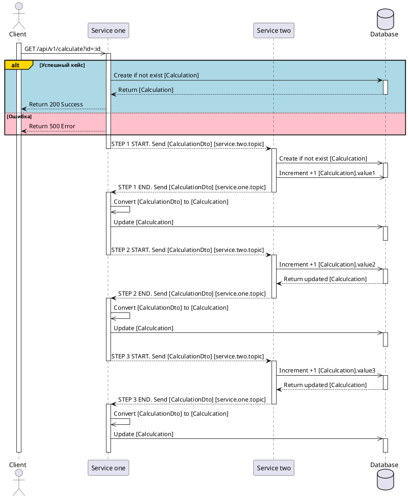

```plantuml
@startuml  
actor client as "Client"  
participant one as "Service one"  
participant two as "Service two"  
database db as "Database"

activate client

client->>one: GET /api/v1/calculate?id=:id 
activate one

alt#Gold #LightBlue Успешный кейс
    one -> db: Create if not exist [Calculation]
    activate db
    db --> one: Return [Calculation]
    deactivate db
    one --> client: Return 200 Success
else #Pink Ошибка
    one -->client: Return 500 Error
end

one --> two: STEP 1 START. Send [CalculationDto] [service.two.topic]
deactivate one
activate two

    two ->> db: Create if not exist [Calculcation]
    activate db
    two ->> db: Increment +1 [Calculcation].value1
    deactivate db


two --> one: STEP 1 END. Send [CalculationDto] [service.one.topic]
deactivate two
activate one

    one ->> one: Convert [CalculationDto] to [Calculcation]
    one ->> db: Update [Calculcation]
    activate db
    deactivate db


one --> two: STEP 2 START. Send [CalculationDto] [service.two.topic]
deactivate one
activate two

    two ->> db: Increment +1 [Calculcation].value2
    activate db
    db --> two: Return updated [Calculcation]
    deactivate db

two --> one: STEP 2 END. Send [CalculationDto] [service.one.topic]
deactivate two
activate one

    one ->> one: Convert [CalculationDto] to [Calculcation]
    one ->> db: Update [Calculcation]
    activate db
    deactivate db


one --> two: STEP 3 START. Send [CalculationDto] [service.two.topic]
deactivate one
activate two

    two ->> db: Increment +1 [Calculcation].value3
    activate db
    db --> two: Return updated [Calculcation]
    deactivate db

two --> one: STEP 3 END. Send [CalculationDto] [service.one.topic]
deactivate two
activate one

    one ->> one: Convert [CalculationDto] to [Calculcation]
    one ->> db: Update [Calculcation]
    activate db
    deactivate db

deactivate db
deactivate two
deactivate one
deactivate client
@enduml  
```